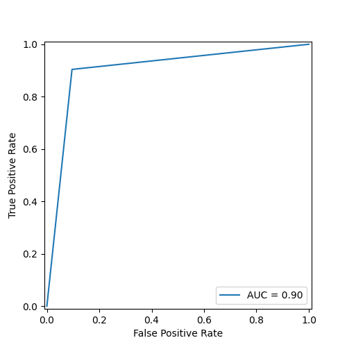
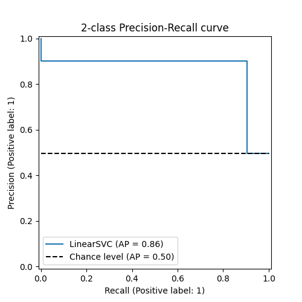

# Model Overview: 1.0
## Table Of Contents
 - [Score](##Score) 
 - [Confusion Matrix](##Confusion-Matrix) 
 - [ROC Curve](##ROC-Curve) 
 - [Precision Recall Curve](##Precision-Recall-Curve) 
 - [Residual Plot](##Residual-Plot) 

## Score
| Type      | Score                         |
|-----------|-------------------------------|
| Accuracy  |  0.904    |
| Precision |  0.903    |
| Recall    |  0.904    |
| F1-Score  |  0.903    |
| MSE       |  0.096    |
| MAE       |  0.096    |
| RMSE      |  0.31    |
| MAPE      |  217974221964732.0    |
| Log Loss  |  3.46    |
| R-Squared |  0.616    |

## Confusion Matrix

## ROC Curve

## Precision Recall Curve

## Residual Plot

