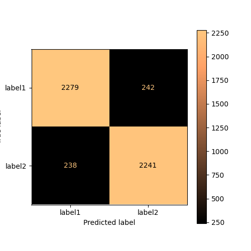
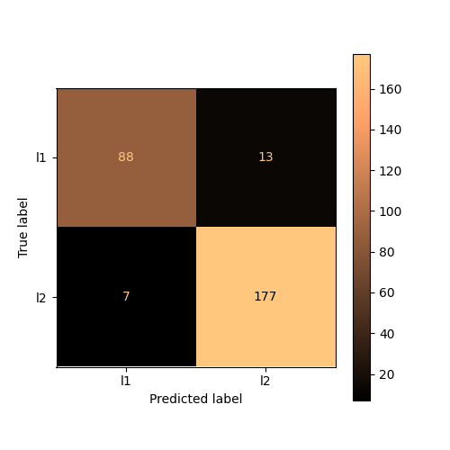
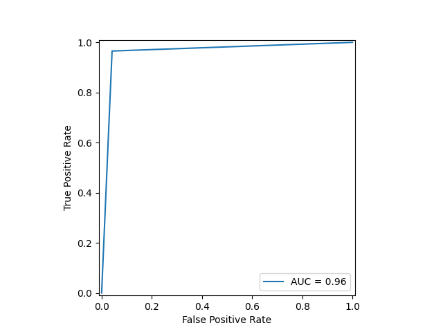
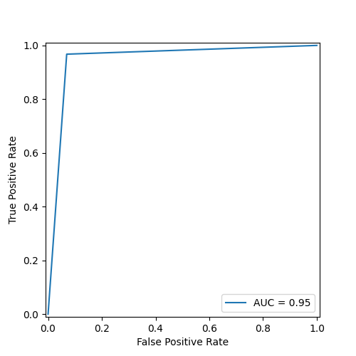
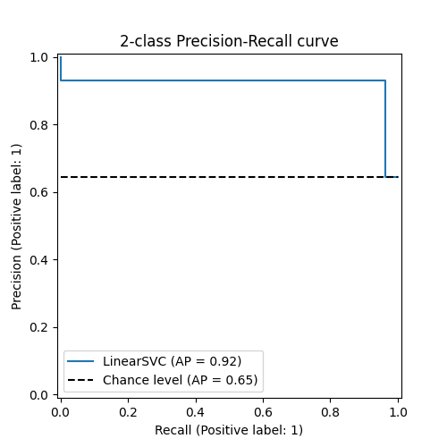
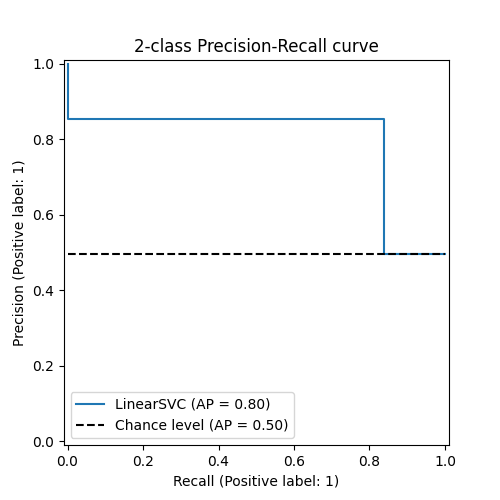

# Model Comparison: 1.0 and 1.1 
## Table Of Contents
 - [Score](##Score-Comparison) 
 - [Confusion Matrix Comparison](##Confusion-Matrix-Comparison) 
 - [ROC Curve Comparison](##ROC-Curve-Comparison) 
 - [Precision Recall Curve Comparison](##Precision-Recall-Curve-Comparison) 

## Score Comparison
| Type      | Score 1.0          | Score 1.1          | Offset                                    |
|-----------|-----------------------------|-----------------------------|-----------------------------------------------------|
| Accuracy  | 0.93 | 0.93 | 0.0 |
| Precision | 0.932 | 0.932 | 0.0 |
| Recall    | 0.962 | 0.962 | 0.0 |
| F1-Score  | 0.947 | 0.947 | 0.0 |

## Confusion Matrix Comparison
Model 1.0                                                      | Model 1.1
:----------------------------------------------------------------------:|:--------------------------------------------------------------:
 | 

## ROC Curve Comparison
Model 1.0                                                      | Model 1.1
:----------------------------------------------------------------------:|:--------------------------------------------------------------:
 | 

## Precision Recall Curve Comparison
Model 1.0                                                      | Model 1.1
:----------------------------------------------------------------------:|:--------------------------------------------------------------:
 | 

