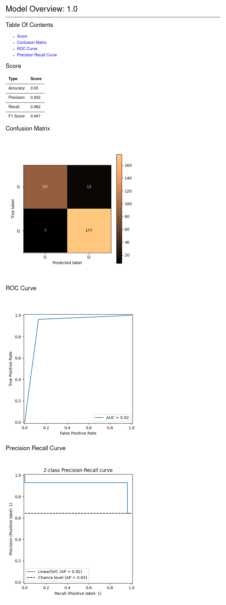
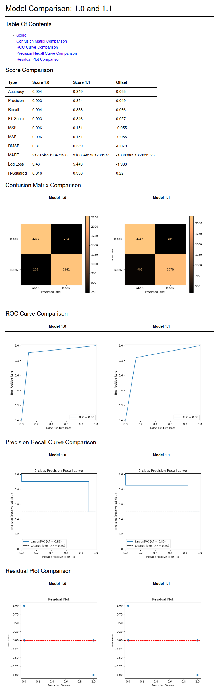

# AI Analyzer
## Description
Easily analyze and compare models result with this python libary.
Its in heavy beta right now, so no docs or really no help at all!
All of the results are saved as markdown files in the .AI_analyzer directory.
Look at the example .AI_analyzer for more information on what is stored where.

## Why?
This is mainly for comparing results of AI models.
When I work with AI, I find myself wondering "Wait, was this models result really better than before?"
I started saving the images plotted in my notebook but it was really just a pain.
This allows you to easily compare models. This also comes with a nice way
of seeing results, so its really no need for individual plotting of confusion matrixes
or scores when using this libary.

## How?
It isn't hard to implement this kind of stuff, and there is 100% 
a libary out there that does the same thing. But for this I had
some fun with this. I created template markdown files that has my own
python integration with it. Its able to connect to a class and
get all of its members and methods and spit it out into the file. Its pretty cool!
To have a closer look, take a look at the templates folder.

## Example Usage
```python
import analyzer

# Relative or absolute root directory.
# The Root directory is basically where
# the .AI_analyzer folder will be saved
analyzer = Analyzer(root_dir="..")

analyzer.model_overview(
    y_test, y_pred, labels,
    model_name="1.0",
    # When using a jupyter notebook,
    # metrics can be ploted to the output,
    # such as the confusion matrix.
    plot_metrics=True,              
    include_confusion_matrix=False
)
```

You could also compare models with this command
```python
analyzer.compare_models("1.0", "1.1")
```

## Example Results
Note that the results will of course depend on your own models
result. This is just an arbetary example models result.

The first usage example will result in this type of markdown file
> **_NOTE:_** As it is exported to png, it wont really look the same. For the full experience, visit ./.AI_analyzer/1.0/result.md



The second usage example will result in this type of markdown file
> **_NOTE:_** As it is exported to png, it wont really look the same. For the full experience, visit ./.AI_analyzer/comparisons/1.0-1.1.md

> **_NOTE:_**  The two models that this is comparing is the same



## Future Features
- Custom templates
- Custom metrics
- Show individual metrics
- More metrics!
